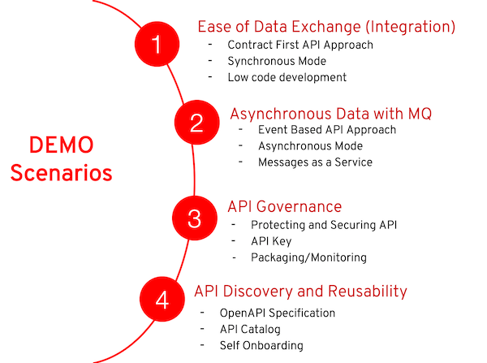

# Agile Integration Demo (Updated to support OCP 4.8)

This repository includes the provisioning scripts and infrastructure for Agile Integration Demo using AMQ Online, Fuse Oneline and 3scale

* [Introduction](#introduction)
* [Deploy on RHPDS](#deploy-on-rhpds)
* [Demo Guide](#demo-guide)

## Prerequisites
* OpenShift Container Storage installed

## Introduction

There are 4 modules in this demo:



## Deploy on RHPDS

Provision your OpenShift environment via the service catalog under **Workshops &rarr; OpenShift 4.8 Workshop**.

## Automated Deploy on OpenShift
You can use the `provision.sh` script provided to deploy the entire demo:

  ```
  ./provision.sh deploy
  ```
You will need to provide the following when provisioning:

* OpenShift Wildcard Domain
* Registry Service Account Username
* Registry Service Account Password

4 OpenShift projects will be created:

* 3scale-project : contains 3scale application
* fuse-online : contains fuse online application
* amq-online : contains amq online application
* demo-project : contains microservices applications

## Demo Parameters

* Take note of these credentials below:

  * PostgreSQL: `demouser/demo123`
  * 3scale: `admin/demo123`
